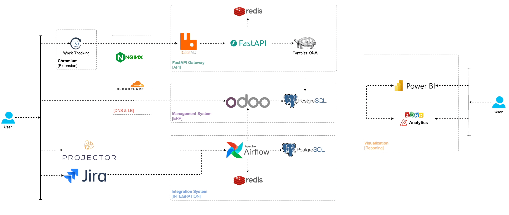

# Overview

# References:
### Time Logging Extension: [link](https://github.com/longbui99/Time-Extension)
### API Integration: [link](https://github.com/longbui99/ERP_FastAPI)
### ERP Management Application: [link](https://github.com/longbui99/Odoo_Timesheet_Engagement)
### Integration Container: [link](https://github.com/longbui99/Erp_Integration_Airflow)
### Reporting: [link](https://github.com/longbui99/Visualization_Reporting)
### DNS and Loadbalancer: [link](https://github.com/longbui99/DNS-Loadbalancer)
